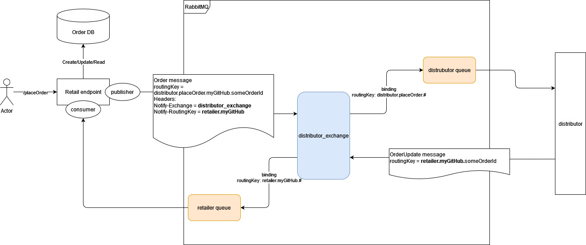

# Задание
## Retailer (текущее приложение)
Публикует rest api:
- /placeOrder - Принимает заказы от пользователя 
- /view/{id} - Отображает статус заказа.

При получении заказа, направляет заказ в distributor через AMQP exchange = distributor_exchange, routingKey = distributor.placeOrder.{githubUsername}.{orderId}, где githubUsername - ваш логин git hub, orderId - id заказа.
Так же необходимо задать заголовки собщения:
- Notify-Exchange = distributor_exchange (где будет ваш consumer)
- Notify-RoutingKey = retailer.{githubUsername} (если ваш routingKey retailer.{githubUsername}**.#**)

В тестах размещен интеграционный тест, который проверяет корректность интеграции

## Distributor
Получает заказ через AMQP. Через некоторое время направляет уведомления о создании и доставке заказа

## Требования к реализации:
- Необходимо реализовать publisher (интерфейс DistributorPublisher) и consumer(самостоятельно) для отправки заказа и получения обновлений статуса заказа
- Хранить заказы в БД (интерфейс OrderStorage)
- Интеграционный тест должен проходить успешно
- При сдаче задания, приложите лог вашего теста в файле RESULT_LOG 

## Запуск окружения
Запустить команду в корне проекта:

`docker-compose up` 

Произойдет запуск композиции сервисов rabbitmq и distributor. RabbitMQ с настройками по умолчанию, как указано в уроках.

После чего можно запускать и тестировать retailer. 
Перезапуск окружения между запусками retailer не требуется.

## Схема интеграции

